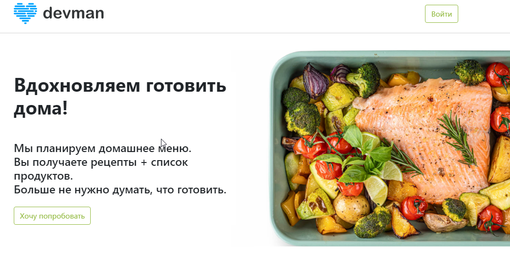
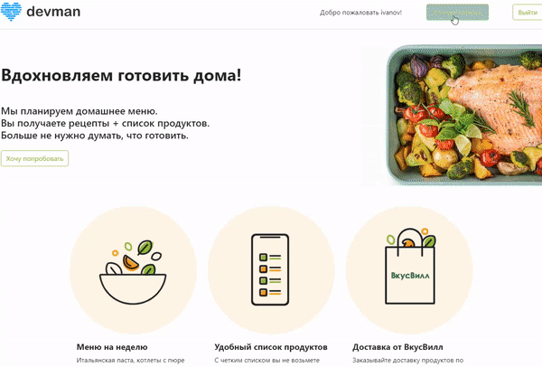
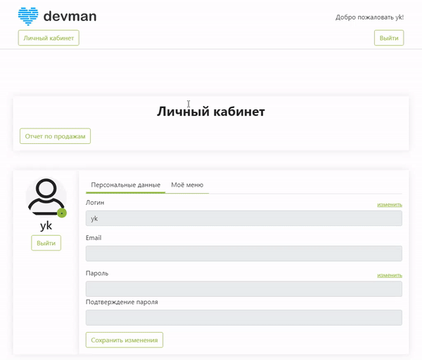

# Food plan

Django-based website: a service that suggests recipes of dishes for everyday usage taking into account the user's preferences

You can see a working example of the site [here](https://food-plan.freemyip.com/).



## Features

### Authorization

A user should authorize before starting the work with the service:


### Subscription payment

A user can pay for a subscription right on the website:


### Personal cabinet

A user sees his settings, subscription, dishes, etc.:



### Sales report

A manager can see the sales report:



## Prerequisites

Python 3.11 is required.

## Installation

- Download the project files.
- It is recommended to use [venv](https://docs.python.org/3/library/venv.html?highlight=venv#module-venv) for project isolation.
- Set up packages:

```bash
pip install -r requirements.txt
```

- Set up environmental variables in your operating system or in the .env file. The variables are:

  - `DEBUG` - a boolean that turns on/off debug mode (optional, `False` by default);
  - `SECRET_KEY` - a secret key for a particular Django installation (obligatory);
  - `ALLOWED_HOSTS` - a list of strings representing the host/domain names that this Django site can serve (obligatory when `DEBUG` is set to `False`);
  - `DATABASE` - a database address (obligatory), go [here](https://github.com/jacobian/dj-database-url) for more;
  - `LANGUAGE_CODE` a string representing the language code for this installation

To set up variables in .env file, create it in the root directory of the project and fill it up like this:

```bash
DEBUG=True
SECRET_KEY=REPLACE_ME
ALLOWED_HOSTS=localhost,127.0.0.1
DATABASE=db.sqlite3
LANGUAGE_CODE=ru-Ru
```

- Create SQLite database:

```bash
python manage.py migrate
```

- Create a superuser:

```bash
python manage.py createsuperuser
```

## Usage

- Run a development server:

```bash
python manage.py runserver
```

- Go to [the admin site](http://127.0.0.1:8000/admin/) and fill the base;
- Go to [the home page](http://127.0.0.1:8000/).

## Project goals

The project was created for educational purposes.
It's a group project for python and web developers at [Devman](https://dvmn.org).
